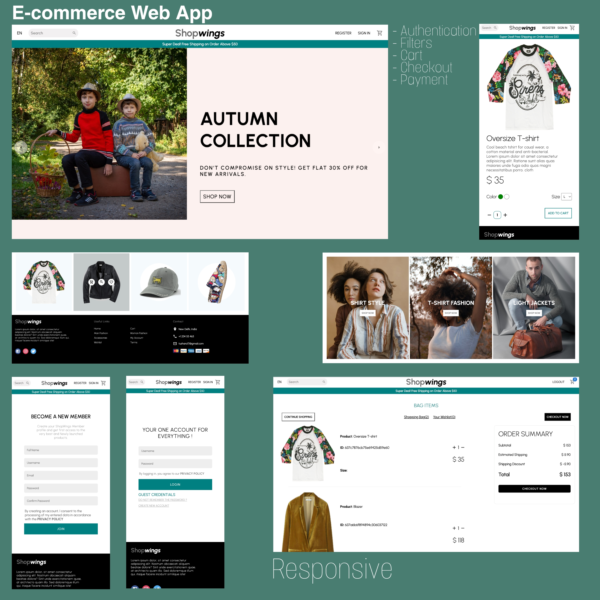

# E-commerce App Using ReactJs | MongoDB |

## [Check it live here](https://shopwingss.netlify.app/)



E-commerce App build using React and MongoDB.

## Tech Info of App

- React for UI
- MongoDB
- React Router for Routing
- Styled Component for styling
- Redux for state management
- MUI for icons

## Getting Started

These instructions will get you a copy of the project up and running on your local machine for development and testing purposes. See deployment for notes on how to deploy the project on a live system.

### Installing

Clone the Repository and run

```
npm i
npm start
```

## Deployment

To deploy simply run

```
npm run build
```

## Built With

- React JS
- React-Router
- Redux
- MongoDB

## Contributing

Please feel free to send pull request if you want to contribute!
